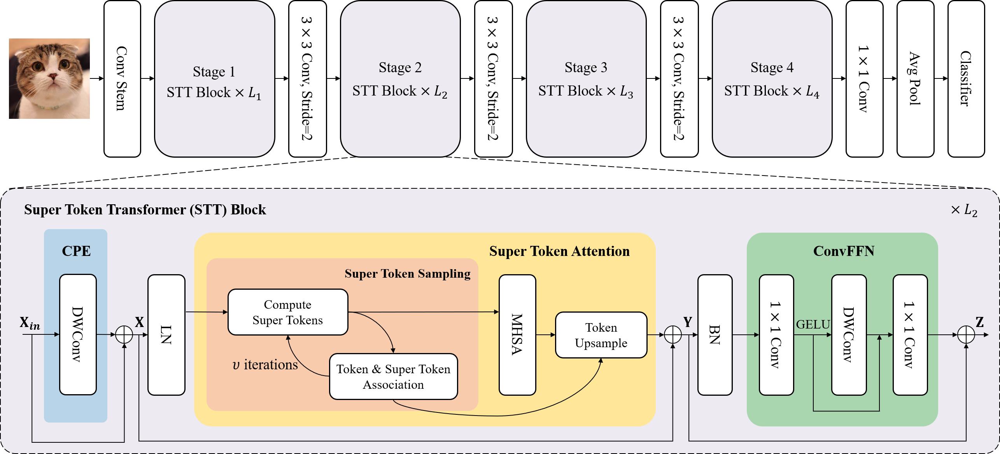

# Vision Transformer with Super Token Sampling (CVPR 2023)

[[arxiv](https://arxiv.org/abs/2211.11167)]

###  Introduction

Vision transformer has achieved impressive performance for many vision tasks. However, it may suffer from high redundancy in capturing local features for shallow layers. Local self-attention or early-stage convolutions are thus utilized, which sacrifice the capacity to capture long-range dependency. A challenge then arises: can we access efficient and effective global context modeling at the early stages of a neural network? To address this issue, we draw inspiration from the design of superpixels, which reduces the number of image primitives in subsequent processing, and introduce super tokens into vision transformer. Super tokens attempt to provide a semantically meaningful tessellation of visual content, thus reducing the token number in self-attention as well as preserving global modeling. Specifically, we propose a simple yet strong super token attention (STA) mechanism with three steps: the first samples super tokens from visual tokens via sparse association learning, the second performs self-attention on super tokens, and the last maps them back to the original token space. STA decomposes vanilla global attention into multiplications of a sparse association map and a low-dimensional attention, leading to high efficiency in capturing global dependencies. Based on STA, we develop a hierarchical vision transformer.
Extensive experiments demonstrate its strong performance on various vision tasks. In particular, without any extra training data or label, it achieves **86.4** top-1 accuracy on ImageNet-1K with less than 100M parameters. It also achieves  **53.9** box AP and **46.8** mask AP on the COCO detection task, and **51.9** mIOU on the ADE20K semantic segmentation task.

 ### Test

The pretrained weights can be downloaded from [Google Driver](https://drive.google.com/drive/folders/1uaT5OarQd9iPrnFufHocHpM3zhyTcetB?usp=sharing).

 Test  STViT-small with 224*224 input-size:

	python -m torch.distributed.launch --nproc_per_node=8 --use_env --master_port 29556 main.py --model stvit_small --data-path IMAGENETPATH  --batch-size 128 --eval --resume ckpt/stvit-small-224.pth --dist-eval  --output_dir ckpt --input-size 224  2>&1 | tee -a log.txt

  Test  STViT-small with 384*384 input-size:

	python -m torch.distributed.launch --nproc_per_node=8 --use_env --master_port 29556 main.py --model stvit_small --data-path IMAGENETPATH  --batch-size 128 --eval --resume ckpt/stvit-small-384.pth --dist-eval  --output_dir ckpt --input-size 384  2>&1 | tee -a log.txt

 Test  STViT-base with 224*224 input-size:

	python -m torch.distributed.launch --nproc_per_node=8 --use_env --master_port 29556 main.py --model stvit_base --data-path IMAGENETPATH  --batch-size 128 --eval --resume ckpt/stvit-base-224.pth --dist-eval  --output_dir ckpt --input-size 224  2>&1 | tee -a log.txt

  Test  STViT-base with 384*384 input-size:

	python -m torch.distributed.launch --nproc_per_node=8 --use_env --master_port 29556 main.py --model stvit_base --data-path IMAGENETPATH  --batch-size 128 --eval --resume ckpt/stvit-base-384.pth --dist-eval  --output_dir ckpt --input-size 384  2>&1 | tee -a log.txt

  Test  STViT-large with 224*224 input-size:

	python -m torch.distributed.launch --nproc_per_node=8 --use_env --master_port 29556 main.py --model stvit_large --data-path IMAGENETPATH  --batch-size 128 --eval --resume ckpt/stvit-large-224.pth --dist-eval  --output_dir ckpt --input-size 224  2>&1 | tee -a log.txt

   Test  STViT-large with 384*384 input-size:

	python -m torch.distributed.launch --nproc_per_node=8 --use_env --master_port 29556 main.py --model stvit_large --data-path IMAGENETPATH  --batch-size 128 --eval --resume ckpt/stvit-large-384.pth --dist-eval  --output_dir ckpt --input-size 384  2>&1 | tee -a log.txt

### Training and Finetuning

Training  STViT-small with 224*224 input-size:

	python -m torch.distributed.launch --nproc_per_node=8 --use_env --master_port 29556 main.py --model stvit_small --data-path IMAGENETPATH  --batch-size 128  --drop-path 0.1 --epoch 300 --dist-eval  --output_dir ckpt --input-size 224  2>&1 | tee -a log.txt

Finetuning STViT-small with 384*384 input-size:

	python -m torch.distributed.launch --nproc_per_node=8 --use_env --master_port 29555 main.py  --data-path IMAGENETPATH  --batch-size 64  --drop-path 0.1 --epoch 30  --finetune ckpt/stvit-small-224.pth  --lr 5e-6 --min-lr 5e-6  --warmup-epochs 0 --weight-decay 1e-8  --input-size 384  --dist-eval  --output_dir ckpt384 2>&1 | tee -a train384.txt

Training  STViT-base with 224*224 input-size:

	python -m torch.distributed.launch --nproc_per_node=8 --use_env --master_port 29556 main.py --model stvit_base --data-path IMAGENETPATH  --batch-size 128  --drop-path 0.4 --epoch 300 --dist-eval  --output_dir ckpt --input-size 224  2>&1 | tee -a log.txt

Finetuning STViT-base with 384*384 input-size:

	python -m torch.distributed.launch --nproc_per_node=8 --use_env --master_port 29555 main.py  --model stvit_base --data-path IMAGENETPATH  --batch-size 64  --drop-path 0.4 --epoch 30  --finetune ckpt/stvit-base-224.pth  --lr 5e-6 --min-lr 5e-6  --warmup-epochs 0 --weight-decay 1e-8  --input-size 384  --dist-eval  --output_dir ckpt384 2>&1 | tee -a train384.txt

 Training  STViT-large with 224*224 input-size (we find that setting drop-path to be 0.4 and 0.6 respectively for the first 260 epochs and last 40 epochs would obtain better results):

	python -m torch.distributed.launch --nproc_per_node=8 --use_env --master_port 29556 main.py --model stvit_large --data-path IMAGENETPATH  --batch-size 128  --drop-path 0.6 --epoch 300 --dist-eval  --output_dir ckpt --input-size 224  2>&1 | tee -a log.txt

Finetuning STViT-large with 384*384 input-size:

	python -m torch.distributed.launch --nproc_per_node=8 --use_env --master_port 29555 main.py  --model stvit_large --data-path IMAGENETPATH  --batch-size 64  --drop-path 0.6 --epoch 30  --finetune ckpt/stvit-large-224.pth  --lr 5e-6 --min-lr 5e-6  --warmup-epochs 0 --weight-decay 1e-8  --input-size 384  --dist-eval  --output_dir ckpt384 2>&1 | tee -a train384.txt

### Results

|Model|Input-size|Params|FLOPs|Acc|
|:---:|:---:|:---:|:---:|:---:|
|SViT-S|224x224|25M|4.4G|83.6%|
|SViT-S|384x384|25M|14.1G|85.0%|
|SViT-B|224x224|52M|9.9G|84.8%|
|SViT-B|384x384|52M|32.5G|86.0%|
|SViT-L|224x224|95M|15.6G|85.3%|
|SViT-L|384x384|95M|49.7G|86.4%|

### Citation
	 @article{huang2022stvit,
	   title={Vision Transformer with Super Token Sampling},
	   author={Huang, Huaibo and Zhou, Xiaoqiang and Cao, Jie and He, Ran and Tan, Tieniu},
	   journal={arXiv:2211.11167},   
	   year={2022}
	  }
